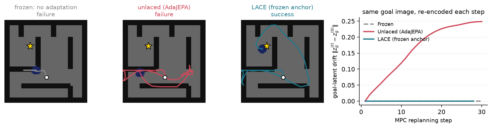
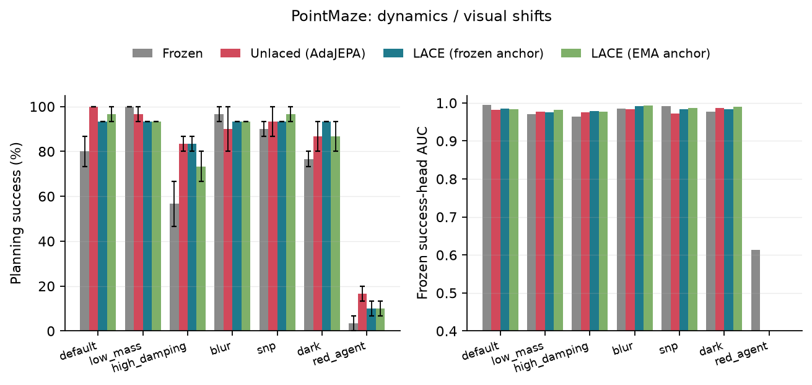
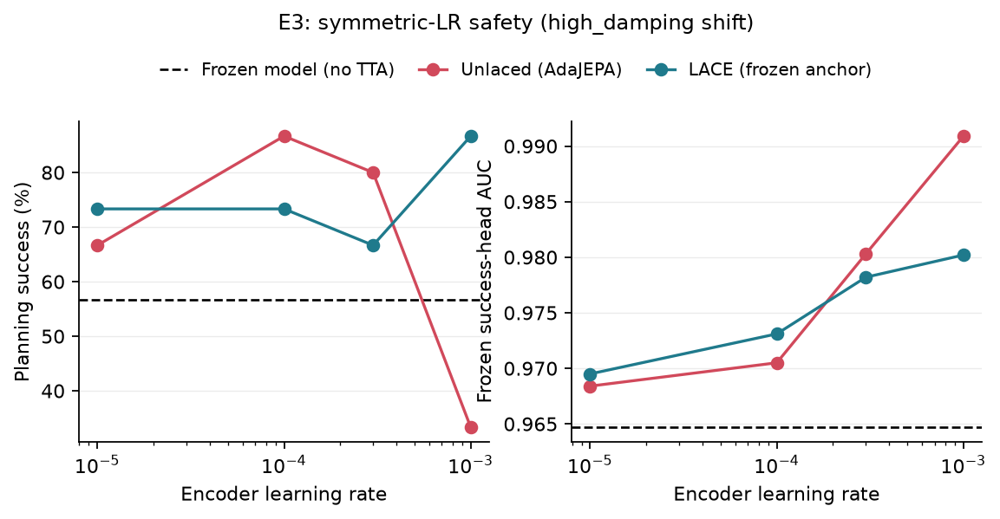
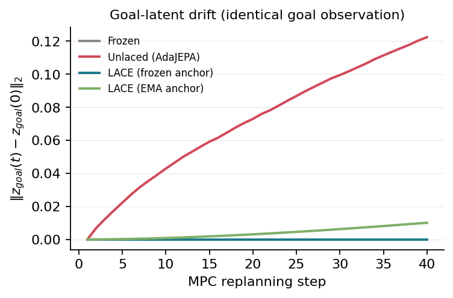
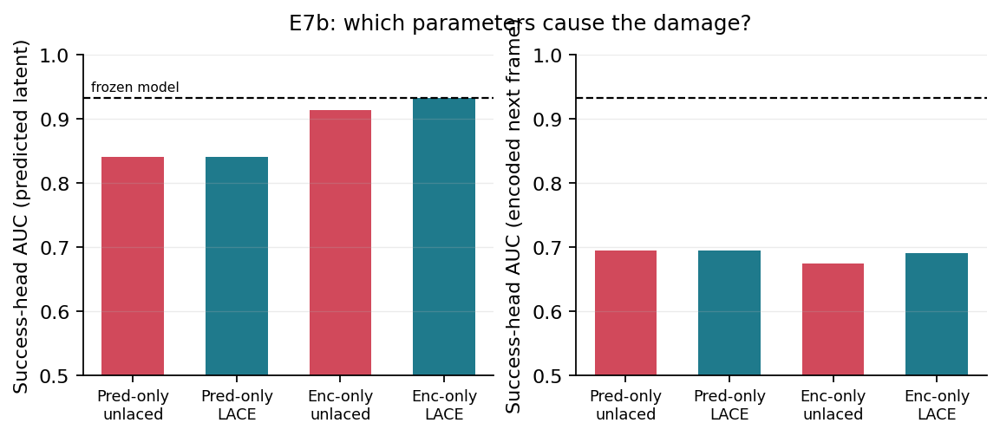

# LACE: Online Encoder Adaptation by Learning Anchored Consistent Embeddings

Code, experiments, and paper for **"LACE: Online Encoder Adaptation by
Learning Anchored Consistent Embeddings"** (C.H. Bourke Floyd IV, 2026).

**TL;DR:** Self-referential test-time adaptation lets a world model's encoder
*relocate the latent space* instead of modeling new dynamics, silently breaking
every frozen consumer while the adaptation loss improves. LACE anchors the
adaptation target to the pretrained encoder — a one-symbol change with no
planning-time cost. It removes the relocation mechanism entirely, but is
necessary rather than sufficient: predictor drift persists.



## Overview

Latent world models paired with model-predictive control act by imagining
futures: an encoder maps observations to latents, a predictor rolls latents
forward under actions, and a planner picks the action sequence whose imagined
future best matches a goal embedding. Test-time adaptation (TTA) lets such a
model track distribution shift inside the control loop: after each executed
action, the observed transition becomes a self-supervised target and the model
takes one gradient step before the next replan.

But the standard objective is **self-referential** — the target is produced by
the very encoder being adapted. Nothing in the loss prefers "model the new
dynamics" over "move the latent space somewhere easier to predict." The loss
cannot see the difference; every frozen consumer of the latent space can. Goal
latents drift although the goal observation never changes, frozen
success/progress heads receive off-manifold inputs, and the planning cost is
evaluated in a space that no longer means what it meant at calibration time.
We first observed this on a deployed screen-interaction agent: adaptation cut
prediction divergence by 45% while the frozen success head's AUC fell from
0.933 to 0.826.

This failure mode is not specific to any one method — it applies to any
JEPA-style world model adapted online with a student-produced target. We study
it on a controlled reproduction of AdaJEPA
([arXiv 2606.32026](https://arxiv.org/abs/2606.32026)), whose TTA objective is
the standard instance.

## Method

AdaJEPA's adaptation objective takes the target from the adapting (student)
encoder:

$$
\mathcal{L}_{\text{ada}} = \big\| f(E_\theta(o_t), a_t) - \mathrm{sg}(E_\theta(o_{t+1})) \big\|^2
$$

The stop-gradient is an anti-collapse stabilizer, not a fix for relocation:
it blocks within-step gradients through the target, but the target is
re-encoded by the updated student at every subsequent step — it is the
student lagging one update behind, so the reference frame still moves
freely.

**LACE** (Learning Anchored Consistent Embeddings) changes one symbol: the
target comes from a frozen (or slow-EMA) copy of the pretrained encoder,

$$
\mathcal{L}_{\text{LACE}} = \big\| f(E_\theta(o_t), a_t) - E_{\bar\theta}(o_{t+1}) \big\|^2
$$

The student encoder and predictor may now adapt at full strength: any
relocation of the latent space is penalized because the target stays put. A
corollary falls out for free — the goal should be encoded by the anchor,
pinning the planner's cost landscape to the space its consumers were
calibrated on. Under LACE, adaptation may only re-express the pretrained
representation, never invent a new one.

The experiment arms, everywhere in the code and results:

| arm | target source | goal encoder | meaning |
|---|---|---|---|
| `frozen` | - | pretrained | no TTA (baseline) |
| `unlaced` | `student` | adapting model | AdaJEPA (self-referential) |
| `laced-frozen` | `frozen` | anchor | LACE, frozen anchor |
| `laced-ema` | `ema` | anchor | LACE, slow-EMA anchor |

## Results

**Anchoring costs no planning success.** Across the PointMaze shift suite
(dynamics + visual + held-out layouts), the laced arms match or beat unlaced
in aggregate — e.g. dynamics shifts: unlaced 90.0%, laced-frozen 88.3%,
frozen 78.3% — and with the gradient-descent planner the anchored arm is
strongest (90.0% vs 70.0% unlaced), because the anchor preserves the
smoothness of the cost landscape.



**Anchoring removes the asymmetric-LR crutch.** The standard defense against
self-referential drift is adapting the encoder ~30x slower than the
predictor. With symmetric learning rates, the self-referential target
collapses planning (33.3%, below the frozen baseline) while the anchored
target keeps improving (86.7%).



**The relocation signature, with no probes needed.** Re-encode the *same*
goal observation at every replanning step: unlaced drifts steadily (roughly
8% of the typical inter-state latent distance by episode end), laced-frozen
is exactly zero by construction, laced-ema stays two orders of magnitude
smaller. The unlaced planner is chasing a target that moves because the map,
not the territory, is changing.



**Necessary but not sufficient.** On 110 replayed deployment runs (5,434
steps), prequential replay decomposes the head damage into two mechanisms:
an encoder-relocation component that LACE removes (encoder-space head AUC
intact, zero goal drift) and a predictor-drift component that persists — the
anchor constrains the target, not predictor overfitting to the small
transition buffer. The pre-registered E7 gate failed and the paper says so.



## Honest reporting

Every gate was pre-registered before the experiment grid ran
([lace/GATES.md](lace/GATES.md)), and every gate's table ships in the paper
whether it passes or fails. Two failed: the PushObj seen-vs-unseen
generalization gate (the miniature benchmark planners operate near their
noise floor, so planning claims rest on the maze and deployment data) and
the E7 deployment gate (predictor drift persists under anchoring). See the
honest-reporting policy in [lace/README.md](lace/README.md).

## Layout

```
adajepa/   the controlled testbed: a faithful reproduction of AdaJEPA
           (numpy PointMaze + pymunk PushObj-mini envs, miniature 1.2M-param
           JEPA world model, CEM/GD planners) plus the LACE anchor knob
           (tta.py: target_source=student|frozen|ema) and frozen probe heads.
           See adajepa/README.md for the quickstart.
lace/      everything paper-specific: pre-registered gates (GATES.md), result
           JSONs (runs/), figure + ablation scripts, the paper source
           (paper/main.tex), and the gate-verdict notebook.
           See lace/README.md for the experiment grid.
```

The baseline (`unlaced`) and the fix (`laced-*`) share every line of code
except the `target_source` knob, mirroring the paper's one-symbol claim.

## Reproducing

1. Install dependencies: `pip install -r adajepa/requirements.txt`
   (torch, numpy, pymunk, matplotlib, jupyter).
2. Follow the quickstart in [adajepa/README.md](adajepa/README.md) to generate
   data and pretrain the world models (minutes on Apple MPS or CPU).
3. Follow [lace/README.md](lace/README.md) to run the E1-E6 experiment grid;
   each command writes a JSON into `lace/runs/`.
4. `cd lace && python scripts/paper_figs.py` regenerates every paper figure
   from `lace/runs/*.json`.

All committed result JSONs in `lace/runs/` and checkpoints in `adajepa/runs/`
are the exact artifacts behind the paper's numbers, with seeds recorded in
each file. E7 (deployed screen-agent replay) uses proprietary deployment
telemetry and is not reproducible from this release; `lace/runs/e7_*.json`
contain aggregate summaries only, which is what the paper reports.

## Citation

```bibtex
@misc{floyd2026lace,
  title  = {LACE: Online Encoder Adaptation by Learning Anchored
            Consistent Embeddings},
  author = {Floyd IV, C.H. Bourke},
  year   = {2026},
  note   = {arXiv preprint, forthcoming}
}
```

This repo also contains a from-scratch reproduction of the baseline it
studies:

```bibtex
@misc{wang2026adajepaadaptivelatentworld,
  title         = {AdaJEPA: An Adaptive Latent World Model},
  author        = {Ying Wang and Oumayma Bounou and Yann LeCun and Mengye Ren},
  year          = {2026},
  eprint        = {2606.32026},
  archivePrefix = {arXiv},
  primaryClass  = {cs.LG},
  url           = {https://arxiv.org/abs/2606.32026}
}
```

## License

MIT - see [LICENSE](LICENSE).
